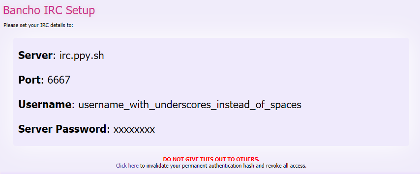

# Unalike Setup Templates

Copy the PHP files from this directory to the parent directory and follow the steps in the comments to finish the setup.

For the sake of readability, I'll list the basic steps here.

## IRC Authentication

- Copy `/setup_help/account.php` to `/account.php` OR create a new file and write `<?php` to its first line.
- Get your IRC details from the [Bancho IRC Setup][osu-irc-url] page and copy the contents from the slightly darker box to the file. Make sure to keep the first line as `<?php` only.

*Reference picture of the Bancho IRC Setup page. If the page has changed since, please open an issue.*

## osu! API Authentication

- Copy `/setup_help/api_key.php` to `/api_key.php`
- Change the `$api_key` variable's contents to your `API Key` from the [API Registration][osu-api-v1-url] page.
- Register a new OAuth application in your [profile settings][osu-api-v2-url].
- Change the `$client_id`, `$client_secret`, and `$callback_uri` to their given values respectively.

## Unalike Shared Local Secret For Anti-abuse

- Copy `/setup_help/local_secret.php` to `/local_secret.php`
- Change the `$local_secret` variable's contents to a secure and preferably long string of numbers and letters.

*(Using symbols and special characters in the local secret is possible but discouraged.)*

[osu-irc-url]: https://osu.ppy.sh/p/irc
[osu-api-v1-url]: https://osu.ppy.sh/p/api
[osu-api-v2-url]: https://osu.ppy.sh/home/account/edit#new-oauth-application

